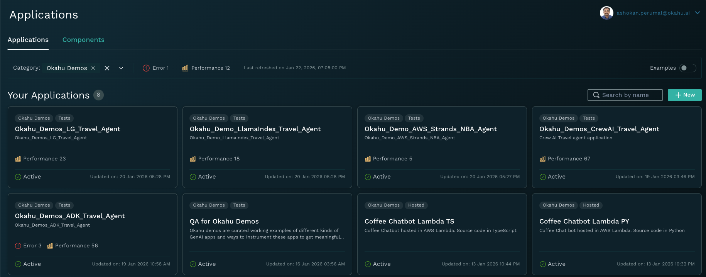
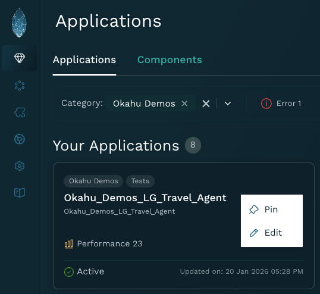
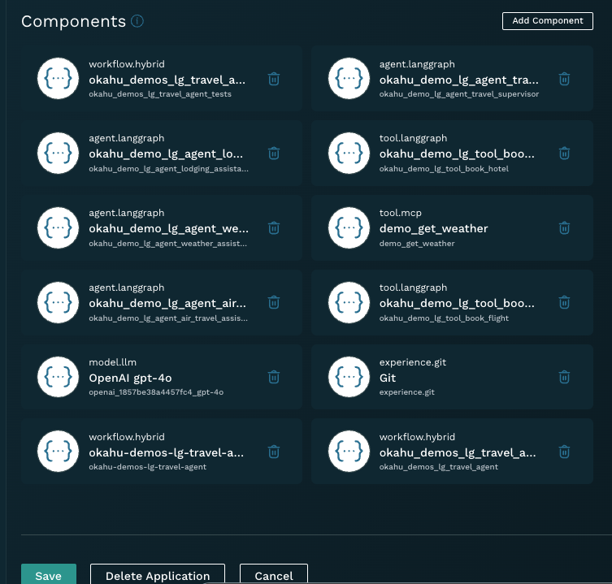

#### About Okahu Observability Cloud 

[Okahu AI Observability Cloud](http://portal.okahu.co/) is a GenAI-native observability platform that simplifies observability & evals required for taking agentic and LLM based apps from lab into prod. 

## Create Application to Visualize traces, tests and evaluations run in the cloud

1. Instrument app with Monocle and send traces to Okahu Cloud.
   
2. In the Okahu Cloud 
    - Login to [Okahu Cloud portal](https://portal.okahu.co) 
    - Select 'Component' tab 
    - Type the workflow name `okahu-demo-lg-travel-agent` in the search box 
    - Click the workflow `okahu-demo-lg-travel-agent` tile 
    - Review traces and prompts generated by the application 

3. Create New Application
    - In the Okahu Cloud, Select 'Application Tab'
    - Add an application, click NEW

    

    - Associate with workflow `okahu-demo-lg-travel-agent` 
    - Get insights on the application from traces in Okahu Cloud  

    
   
    - Ask the Kahu Debug agent to find root cause of the issue 

   

4. Modify or Recreate existing application Okahu Cloud
    - In the Okahu Cloud, Select 'Application Tab'
    - Select the application which needs modification

    

    - Scroll down to the Components Section in the page
    - Delete the components which are not required

   

    - Associate the new component(s)
    - Save the application
   
   

    - Navigate to Architecture tab
    - Click Discover to associate all the need components
    
_________________
[^1]: Use of Okahu hosted demo is covered by Okahu's [terms of service for evaluations](https://www.okahu.ai/agreements/evaluation-agreement). 
  [Okahu](https://www.okahu.ai) is a team of AI, observability & cloud engineers working to simplify observability for agentic and other GenAI apps. We serve AI app developers, platform engineers and engineering leaders to build reliable, accurate and safer AI apps. We believe in community driven open source software and are a major contributor to GenAI native observability Project Monocle hosted by Linux Foundation.
  Connect with us on [Linkedin](https://www.linkedin.com/company/99272699/admin/dashboard/), [Github](https://github.com/okahu) or email us at <dx@okahu.ai>
